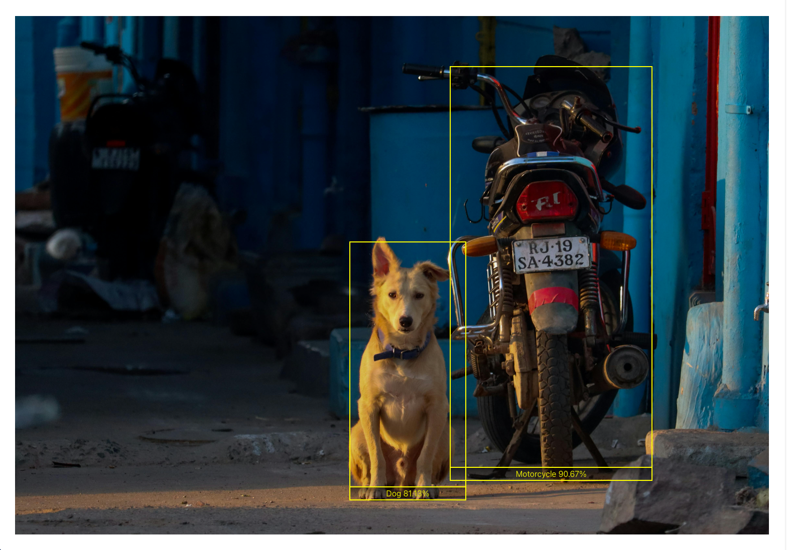

# Web AI Proto

## Overview



This uses Tensorflow's object detection model.

<details>
  <summary>Known Objects</summary>
person, bicycle, car, motorcycle, airplane, bus, train, 
truck, boat, traffic light, fire hydrant, stop sign, 
parking meter, bench, bird, cat, dog, horse, sheep, 
cow, elephant, bear, zebra, giraffe, backpack, umbrella, 
handbag, tie, suitcase, frisbee, skis, snowboard, 
sports ball, kite, baseball bat, baseball glove, 
skateboard, surfboard, tennis racket, bottle, 
wine glass, cup, fork, knife, spoon, bowl, 
banana, apple, sandwich, orange, broccoli, 
carrot, hot dog, pizza, donut, cake, chair, couch, 
potted plant, bed, dining table, toilet, tv, 
laptop, mouse, remote, keyboard, cell phone, 
microwave, oven, toaster, sink, refrigerator, 
book, clock, vase, scissors, teddy bear, hair drier, 
toothbrush
</details>

## Setup

add a .env file with your Pexels API in the following format.

```bash
VITE_PEXELS_API_KEY=YourApiKeyGoesHere
```

